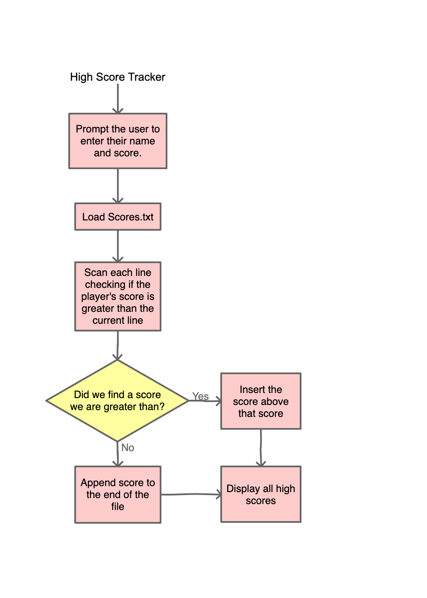
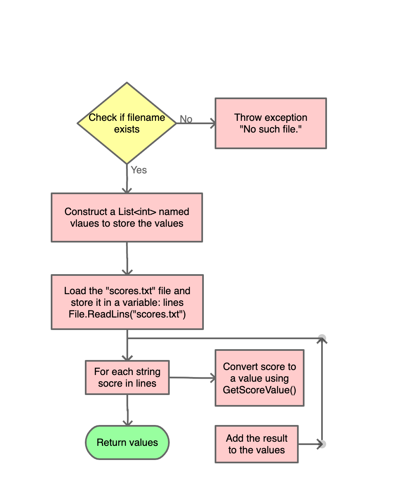
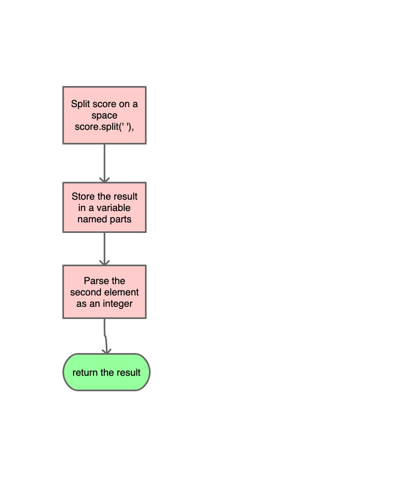

# The High Score Tracker

## Description
The High Score tracker will allow a program to digitally keep track of high scores without the need for memorization or pen & paper!

## Overview
The High Score Tracker keeps a record of the high scores for a game. After a game ends, the player will enter their name and score using their keyboard. The player’s score is added to a high score list in the correct location. Lastly, the updated high score list is output to the console. 

## High-Level Design
### Flowchart



### Methods:
I have broken down the program into 4 methods:
- static List<int> LoadScoreValues(string filename);
- static int GetScoreValue(string score);
- static int FindInsertionPoint(List<int> values, int newScore);
- static void AddScore(String name, int score, int insertAt, List<String> scores);

### List LoadScoreValues(string filename)
The scores.txt file is stored in two columns. The first column is the players name and the second column is the players score. This method loads the file and extracts the second column into a ```List<int>.```



1. Check to see if the specified filename exists.
2. If it does not, throw an exception stating the file cannot be loaded
3. Load the file as a List and store it in a variable named, "lines"
4. Create a List called values.
5. Loop through each line
   - For each line, use GetScoreValue to extract the second column as an int
   - Add the int to values
6. Return values

### int GetScoreValue(string score)
This is a helper method which, given a score string of the format "name score", extracts the score value from the second column, parses it into an int value, and finally returns it.



1. Split the specified score string into two strings using ' ' as a delimiter
2. Store the result in a variable called parts
3. Parse the second element as an int int.Parse(parts[1])
4. Return the result

### int FindInsertionPoint(List values, int newScore)
Given a list of score values and a newScore to insert into the high scores table, returns the index where the new score should be inserted.


1. Initialize a counter variable, insertAt, to 0.
2. Loop through each value in values
   - If the new score is greater than the current value, we should insert above that score so we return insertAt
   - Otherwise, the new score should not be inserted above this score so we increment insertAt by 1 and continue.
3. If we reach the end of the list, insertAt should be the length of the list so we return insertAt.

### void AddScore(string name, int score, int insertAt, List scores);
Given the name, score, insertion location, and a list of strings containing the current high scores, inserts the name and score at the specified location. Then writes the results to "scores.txt".


1. Create a string variable entry which will be the new row to add to the high score list.
2. Assign entry to be $"{name} {score}"
3. Insert entry into scores at the index insertAt
4. Use File.WriteLines to write each line of the scores list to the file "scores.txt"


